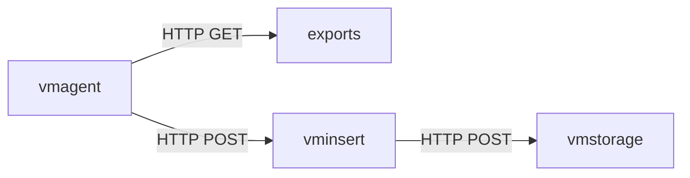
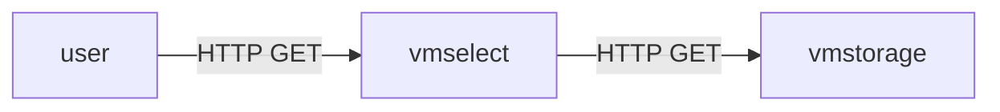

# VectoriaMetrics
VictoriaMetrics is a fast, cost-effective and scalable monitoring solution and time series database

## references
- https://docs.victoriametrics.com/Cluster-VictoriaMetrics.html#cluster-setup
- https://docs.victoriametrics.com/vmagent.html?highlight=remoteWrite.label#adding-labels-to-metrics
- https://docs.victoriametrics.com/vmagent.html
- https://docs.victoriametrics.com/vmagent.html#how-to-collect-metrics-in-prometheus-format
- https://docs.victoriametrics.com/sd_configs.html
- https://docs.victoriametrics.com/relabeling.html
- https://docs.victoriametrics.com/vmalert.html

## metrics data flow
- metrics ingest


- metrics query


## deployment
- clone this repository
```shell
git clone git@gitlab.v16cp.me:sre/monitor/victoriametrics.git && cd victoriametrics/k8s_manifests
```

- cluster servers deployment
```shell
# check resource will created
kubectl kustomize --load-restrictor LoadRestrictionsNone server

# deploy to k8s
kubectl kustomize --load-restrictor LoadRestrictionsNone server | kubectl apply -f - 
```

- example deployment to uat environment
```shell
export TARGET_ENV=uat
# check resource will created
kubectl kustomize --load-restrictor LoadRestrictionsNone edge/$TARGET_ENV

# deploy to k8s
kubectl kustomize --load-restrictor LoadRestrictionsNone edge/$TARGET_ENV | kubectl apply -f - 
```
